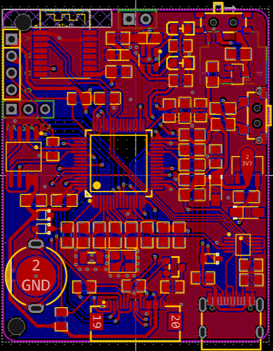
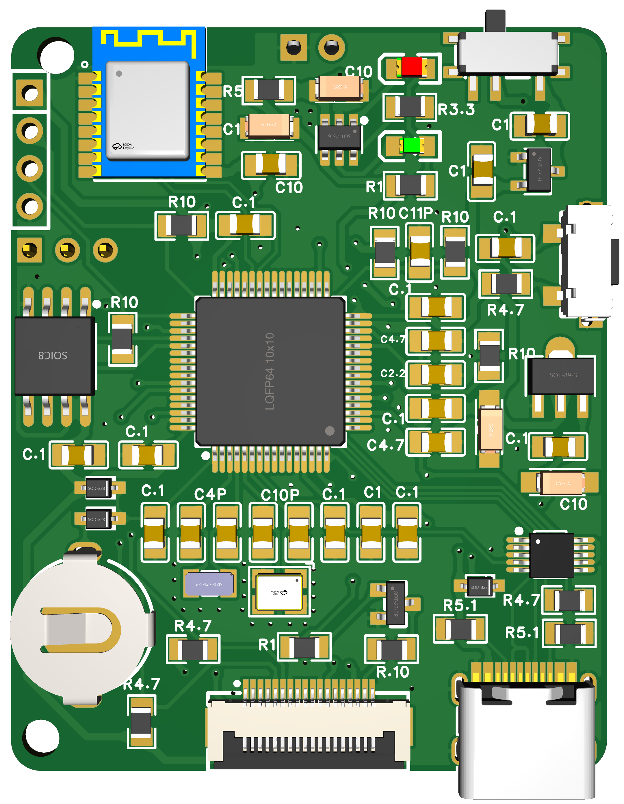
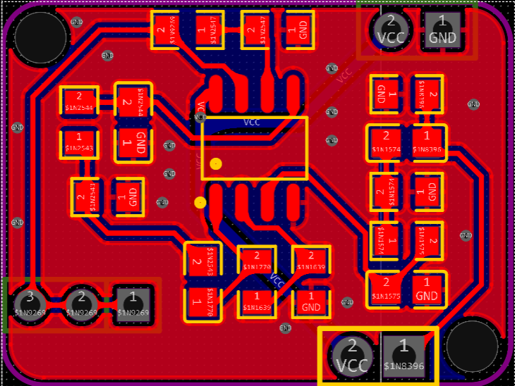
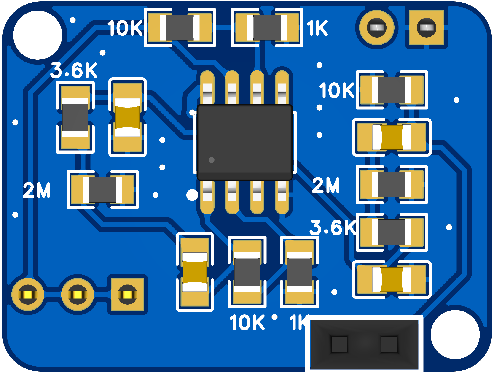
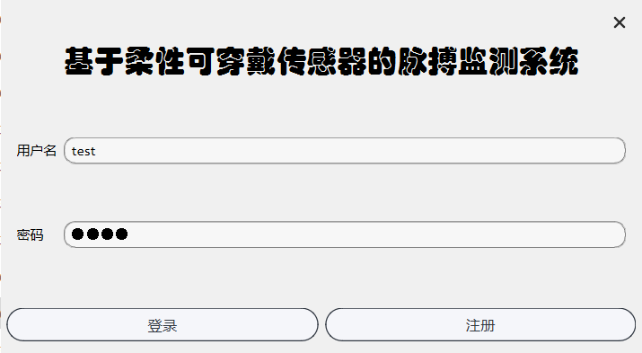
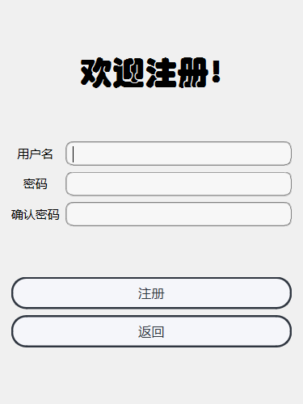
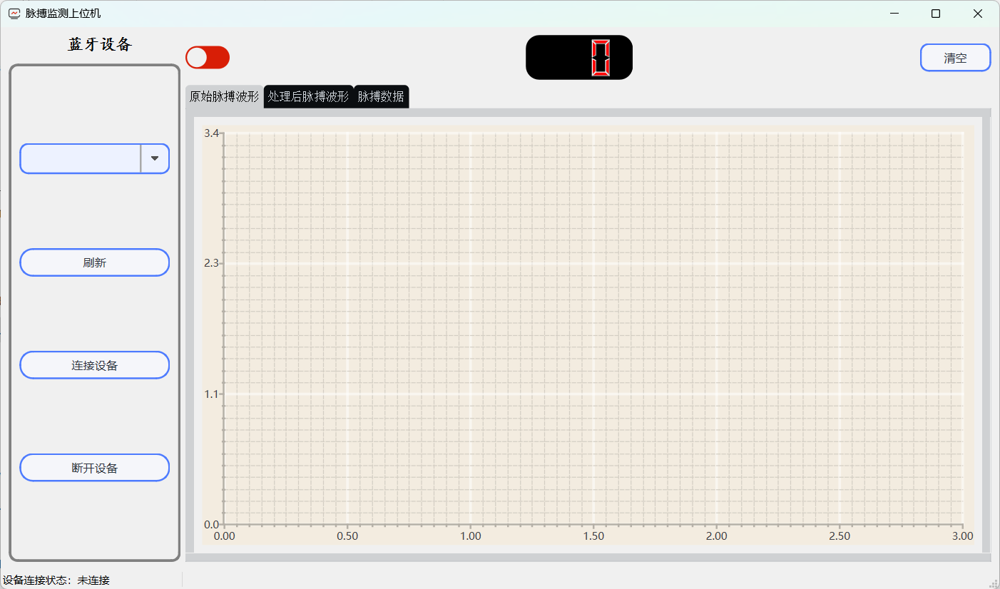

# 简介
设计了一种基于柔性可穿戴传感器的脉搏监测系统。采用 STM32F402RCT6 微控制器，实现了可穿戴的脉搏监测硬件系统。采用 Qt 框架开发了一款具有脉搏信号预处理、脉搏频率特征分析、脉搏波形显示等功能的脉搏监测上位机软件系统。
# 硬件设计
脉搏监测系统的硬件是使用立创 EDA 专业版软件设计的。
## 1.主控板
设计文件[ProProject_PMOR_V3.zip](Hardware\ProProject_PMOR_V3.zip)
### 1.1 原理图

### 1.2 PCB

### 1.3 3D实物

## 2.信号采集放大板
设计文件[ProProject_PMOR_V3.zip](Hardware\ProProject_R2V_V3.zip)
### 2.1 原理图

### 2.2 PCB

### 2.3 3D实物

# 软件设计
## 1.STM32的源码[LowerComputerSource](Software\LowerComputerSource\readme.md)
使用 C 语言以及 GNU Arm 嵌入式工具链，基于 1.9.0 版的 STM32F4 的 DSP 和标准外设库开发、编译
## 2.STM32可直接烧录的文件[STM32BurnableFiles](Software\STM32BurnableFiles\readme.md)
使用JLINK等其他烧录工具烧录其中一个文件即可
## 3.上位机源码[UpperComputerSource](Software\UpperComputerSource\readme.md)
使用C++基于Qt6编写，界面使用Qt Designer设计
## 4.上位机可执行程序[UpperExecutableProgram](Software\UpperExecutableProgram\readme.md)
双击其中的exe文件即可运行
### 4.1 登陆界面

### 4.2 注册界面

### 4.3 主界面

# 系统运行测试
